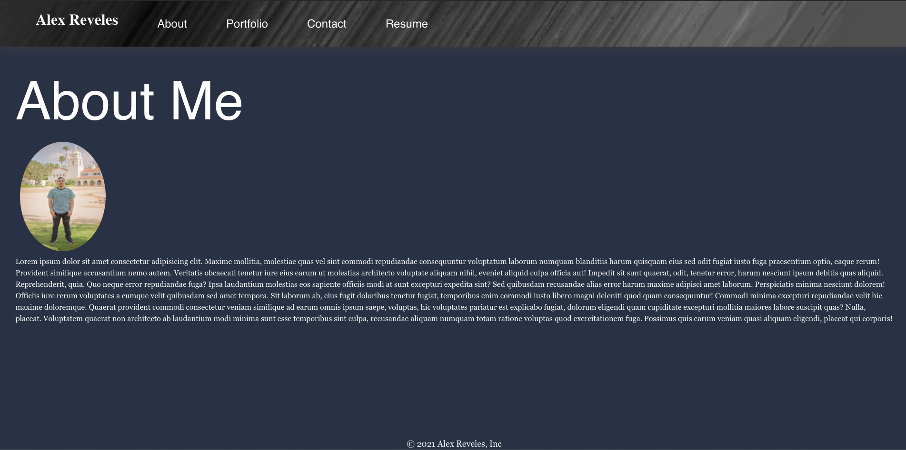

### React Portfolio 
  
## Description
As an employer looking for candidates with experience building single-page applications
I want to view a potential employee's deployed React portfolio of work samples
so that I can assess whether they're a good candidate for an open position.

  ##  Table of Contents
  * [Installation](#installation)
  * [Usage](#usage)
  * [License](#License)
  * [Contributing](#contributing)
  * [Tests](#Tests)
  * [Questions](#questions)
  
  ## Usage
  In order to run this application, you must fork my repo to your local machine and run it using npm start, before doing so please install to your local terminal React using `npx create-react-app my-app`.
  
  
  # License
  This project is  licensed MIT license.
  
  ## Contributing
  Contributors: Alex Reveles
  ## Test
  The following is needed to run the test: `npm start`.
  ## Questions
  If you have any questions regarding about the application, please contact me.
* [Github](https://github.com/alexreveles)
* [Email](https://alexreveles@yahoo.com) alexreveles@yahoo.com

### https://github.com/alexreveles/react-portfolio
### https://github.com/alexreveles

